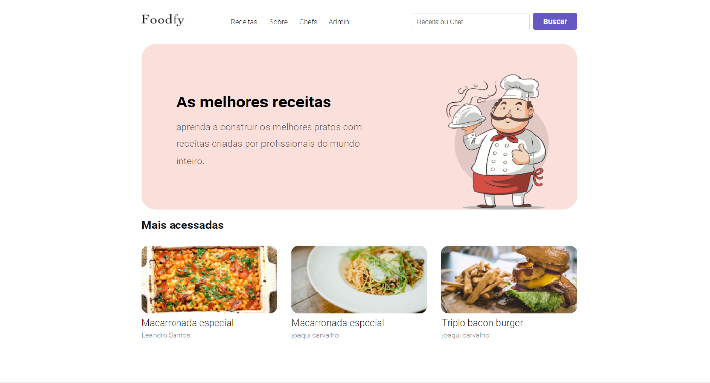
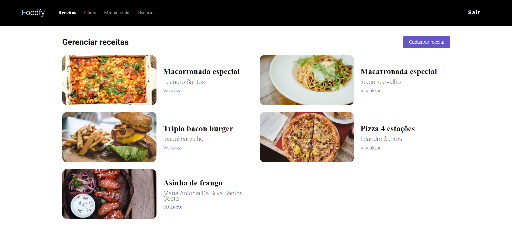

# Foodfy

  
<h1 align ="center">
    
</h1>

<h1 align ="center">Uma aplicação feita para apresentar receitas de chefs profissionais de todo o mundo.</h1>

**<h3>Site</h3>**

<h2 align ="center"> 

<h2>

Um sistema feito para usuarios que querem registrar suas receitas e vinculalas a um chef aonde cada usuario pode criar e edita suas receitas

### **Diferenciais**:  
Controle de pefis de usuários | Filtro por receita ou chef | Paginação por numero de paginas  | Totalmente responsivo
 

**<h3>Admin</h3>**

<h2 align ="center"> 

<h2>

No painel administrativo so tera acesso a todos os usuarios a conta que receber um perfil de administrador aonde ele pode cadastrar usuarios dentro do sistema e enviar a senha para o email desse usuario, cadastrar chefs receitas, caso não seja admin so poderar criar receitas  

 
 
<h1>Tecnologias utilizadas</h1>

<li>Html 5 | Css 3 | JavaScript | NodeJs | Express 

 
 

Obs: para utilizar o sistema basta rodar fazer o clone do projeto e depois npm install para instalar todas as dependencias logo apos basta rodar o arquivos seed.js para poder criar uma conta padrao administrador

Login: admin@admin.com  
Senha: 1111
